# flights-data-engineering-a
Repositorio para el desarrollo de análisis de información de vuelos
## Estructura del Proyecto

```
etl/
  ├── bronze.py    # Capa Bronze - Extrae e ingesta datos crudos
  ├── silver.py    # Capa Silver - Limpieza y transformación
  └── gold.py      # Capa Gold - Análisis y agregaciones
src/
  └── utils/       # Utilidades compartidas
ingestion.sh       # Script para descargar datos desde S3
etl.sh             # Script para ejecutar el pipeline ETL
config.sh          # Configuración centralizada de parámetros
```

## Configuración

Edita `config.sh` para configurar los parámetros:
```bash
export S3_BUCKET="itam-analytics-dante/flights-hwk"
export DATA_DIR="data"
```

## Ejecución

### 1. Descargar datos

```bash
./ingestion.sh
```

Descarga `flights.zip` desde S3 y lo extrae en el directorio configurado en `config.sh`.

### 2. ETL - Capa Bronze

La capa Bronze extrae e ingesta los datos crudos desde CSV a Parquet en S3.

**Descripción:**
- **Extract**: Lee los archivos CSV crudos (`airlines.csv`, `airports.csv`, `flights.csv`) desde el directorio local
- **Validate**: Verifica que las tablas pequeñas no estén vacías y valida que columnas clave no tengan nulos
- **Load**: Crea la base de datos `flights_bronze` en Glue Catalog y escribe las tablas como Parquet en S3

**Tablas procesadas:**
- `airlines` - Tabla pequeña (cargada completa)
- `airports` - Tabla pequeña (cargada completa)
- `flights` - Tabla grande (procesada en chunks de 500,000 filas)

**Ejecución:**

```bash
# ejemplo  python etl/bronze.py --bucket etl-tarea-8/etl --data-dir data/flights/
python etl/bronze.py --bucket <tu-bucket> --data-dir <ruta-csvs>
```

Ejemplo con configuración en `config.sh`:
```bash
python etl/bronze.py --bucket $S3_BUCKET --data-dir $DATA_DIR
```

**Argumentos:**
- `--bucket`: Nombre del bucket S3 donde almacenar los datos procesados
- `--data-dir`: Directorio local donde están los archivos CSV

**Requisitos:**
- AWS CLI configurado
- Python 3.8+
- Librerías: `pandas`, `awswrangler`

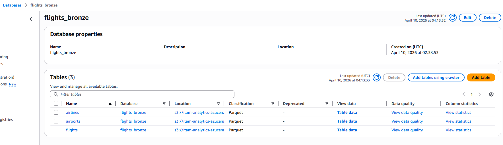
---

### 3. ETL - Capa Silver

La capa Silver transforma los datos crudos de Bronze en métricas agregadas y limpias.

**Descripción:**
- **Transform**: Genera tres tablas analíticas a partir de `flights_bronze.flights`
- **Validate**: Aplica asserts antes de escribir para garantizar integridad de los datos
- **Load**: Escribe las tablas como Parquet en S3 y las registra en Glue Catalog (`flights_silver`)

**Tablas generadas:**
- `flights_daily` — métricas por año/mes/día: vuelos totales, retrasados, cancelados y delays promedio (excluye cancelados)
- `flights_monthly` — métricas por mes/aerolínea: totales, delays y porcentaje on-time
- `flights_by_airport` — métricas por aeropuerto de origen: salidas, delays y porcentaje de retraso por clima

**Ejecución:**

```bash
python etl/silver.py --bucket <tu-bucket>
```

**Argumentos:**
- `--bucket`: Nombre del bucket S3 (puede incluir prefijo, ej. `mi-bucket/etl`)

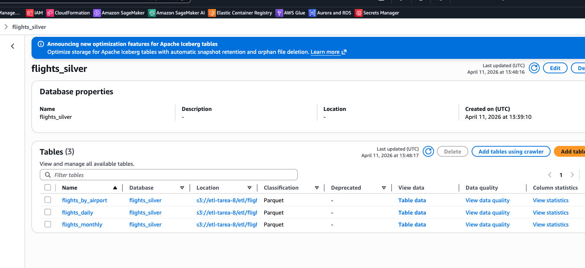

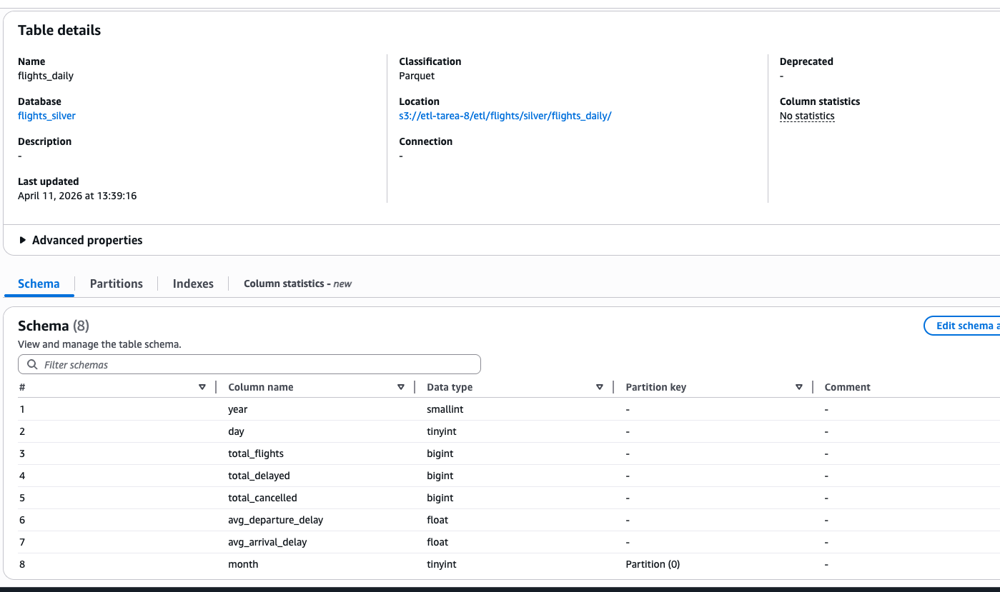

---

### 4. ETL - Capa Gold

La capa Gold construye una tabla analítica enriquecida en Athena cruzando vuelos con aerolíneas y aeropuertos.

**Descripción:**
- **CTAS**: Ejecuta un `CREATE TABLE AS SELECT` en Athena sobre las tablas de `flights_bronze`
- Enriquece cada vuelo con el nombre completo de la aerolínea, nombre y ubicación del aeropuerto de origen y destino
- Registra la tabla resultante en Glue Catalog bajo `flights_gold`

**Tabla generada:**
- `vuelos_analitica` — tabla desnormalizada con columnas de vuelos + aerolínea + aeropuertos (origen y destino)

**Columnas principales:**

| Columna | Descripción |
|---|---|
| `year`, `month`, `day` | Fecha del vuelo |
| `origin_airport` / `destination_airport` | Código IATA |
| `origin_airport_name`, `origin_city`, `origin_state` | Datos del aeropuerto de origen |
| `destination_airport_name` | Nombre del aeropuerto de destino |
| `airline_name` | Nombre completo de la aerolínea |
| `departure_delay`, `arrival_delay` | Minutos de retraso |
| `cancelled`, `cancellation_reason` | Estado de cancelación |
| `distance` | Distancia del vuelo en millas |
| `air_system_delay`, `airline_delay`, `weather_delay`, `late_aircraft_delay`, `security_delay` | Desglose de causas de retraso |

**Prerequisitos:**
- Las capas Bronze y Silver deben haberse ejecutado previamente
- El bucket debe contener los datos de `flights_bronze` registrados en Glue Catalog

**Ejecución:**

```bash
python etl/gold.py --bucket <tu-bucket>
```

**Argumentos:**
- `--bucket`: Nombre del bucket S3 donde están los datos Bronze

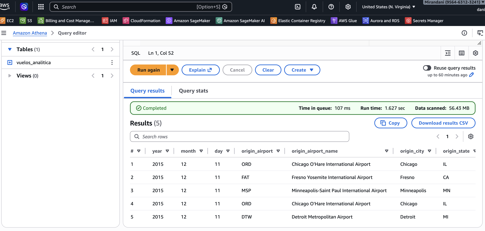

---

### 5. Notebook — Carga a RDS PostgreSQL

`notebooks/sql_alchemy.ipynb` carga los datos de vuelos en una base de datos PostgreSQL en AWS RDS usando SQLAlchemy 2.0.

**Descripción:**
- Define el schema relacional de las tres tablas (`airlines`, `airports`, `flights`) con sus llaves primarias y foráneas
- Conecta al endpoint primario de RDS obteniendo las credenciales desde AWS Secrets Manager (`itam/rds/flights/credentials`)
- Inserta los datos desde CSV usando bulk insert, respetando el orden de dependencias FK
- Incluye un ERD interactivo con las relaciones entre tablas
- Verifica la carga consultando `information_schema` y conteos de filas por tabla

**Tablas creadas en RDS:**
- `airlines` — catálogo de aerolíneas (`iata_code` PK)
- `airports` — catálogo de aeropuertos (`iata_code` PK, incluye coordenadas)
- `flights` — vuelos con FK a `airlines` y `airports` (~500,000 registros)

**Prerequisitos:**
- Secret `itam/rds/flights/credentials` creado en AWS Secrets Manager con `dbname`, `username`, `password`, `port`
- Stack de CloudFormation `infra/rds-flights.yaml` desplegado (RDS activo)
- Archivos CSV en `data/flights/` (`airlines.csv`, `airports.csv`, `flights.csv`)

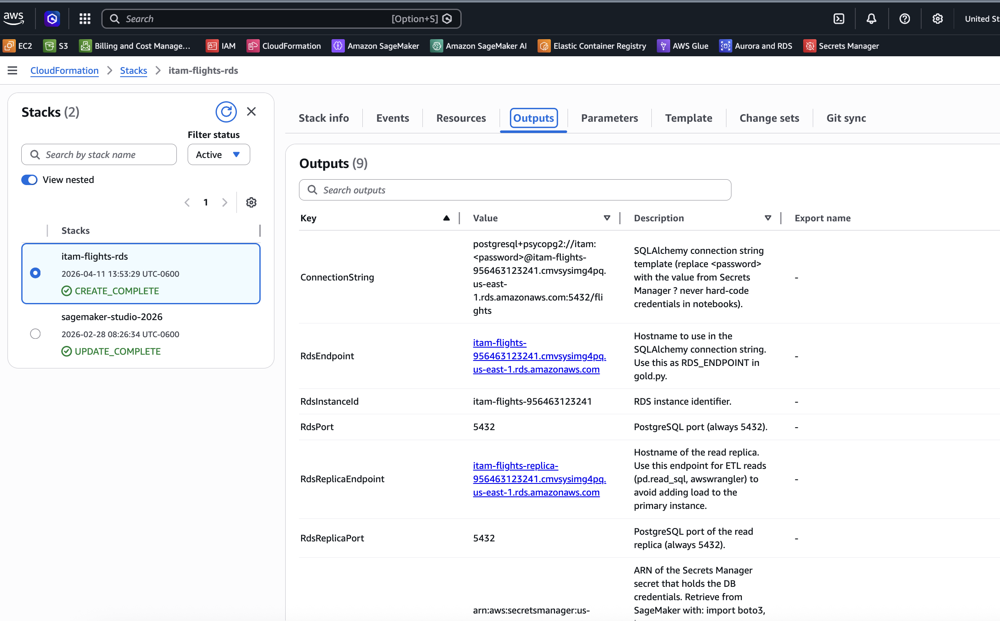
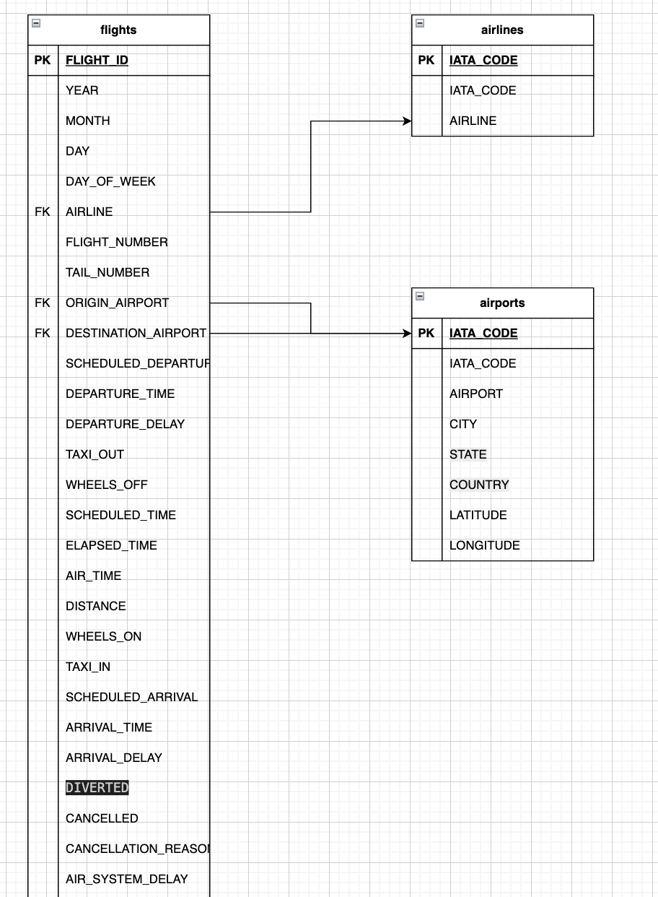

---

### 6,7. Notebook — Análisis de Vuelos

`notebooks/flights_analytics.ipynb` ejecuta 8 queries analíticas sobre los datos de vuelos conectándose a la **Read Replica** de RDS. Las queries de capa Silver se ejecutan directamente contra Athena.

**Conexión:**
- Usa SQLAlchemy + `pd.read_sql` apuntando al endpoint de la réplica de lectura
- Las queries P4 y W2 usan `wr.athena.read_sql_query` contra `flights_silver`
- Credenciales obtenidas desde Secrets Manager (`itam/rds/flights/credentials`)

**Queries ejecutadas:**

| ID | Pregunta | Fuente | Visualización |
|---|---|---|---|
| P1 | Top 10 rutas con mayor número de vuelos | RDS | Barras horizontales (Plotly) |
| P2 | Top 5 aerolíneas con mayor % de cancelaciones | RDS | Barras (Plotly) |
| P3 | Vuelos cancelados por causa (`cancellation_reason`) | RDS | Tabla formateada (great_tables) |
| P4 | Retraso promedio de salida por mes (vuelos retrasados no cancelados) | Athena | Línea con área (Matplotlib) |
| P5 | Top 10 aeropuertos con más minutos de retraso por clima | RDS | Barras horizontales (Plotly) |
| W1 | Vuelo con mayor retraso de llegada por aerolínea — `RANK()` | RDS | Tabla con color (great_tables) |
| W2 | Variación mes a mes en total de vuelos — `LAG()` | Athena | Línea + barras doble eje (Plotly) |
| W3 | Primeros 5 vuelos desde LAX el 2015-01-01 — `ROW_NUMBER()` | RDS | Tabla con color (great_tables) |

**Prerequisitos:**
- Read Replica de RDS activa y accesible
- Capas Bronze y Silver ejecutadas (para P4 y W2 vía Athena)
- Librerías: `sqlalchemy`, `psycopg2`, `pandas`, `plotly`, `matplotlib`, `great_tables`, `awswrangler`

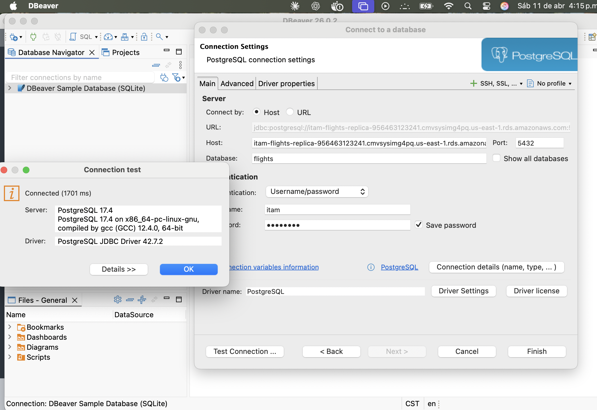
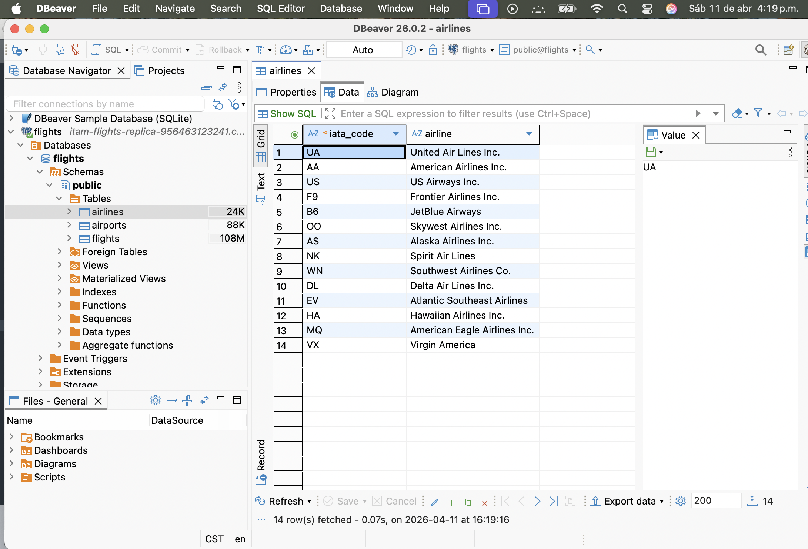

**Consultas**

**P1**
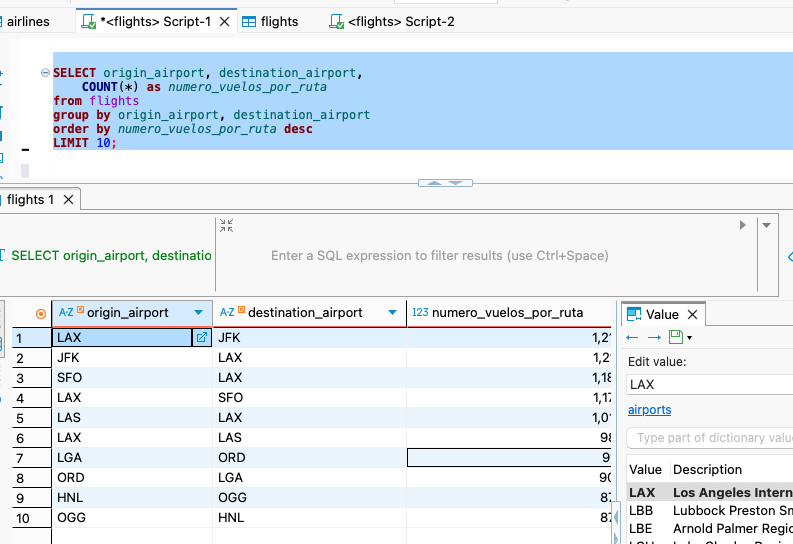

**P2**
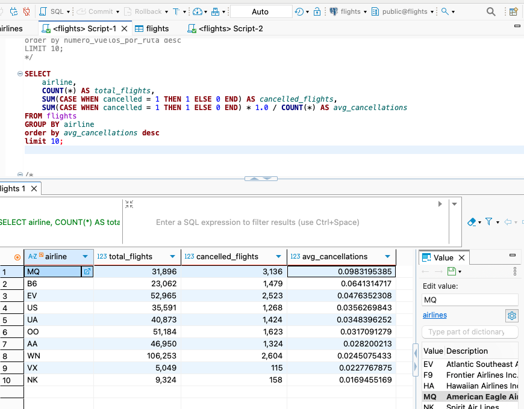

**P3**
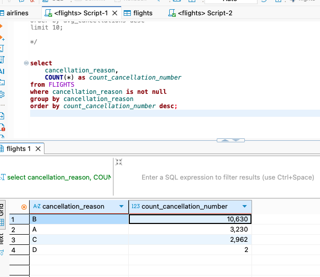

**P4**
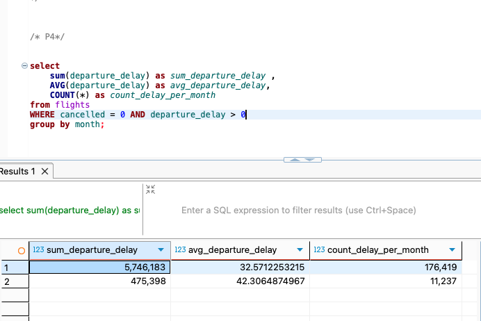

**P5**
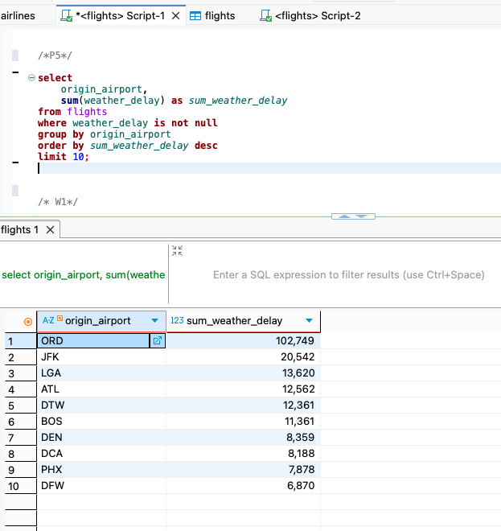

**W1**
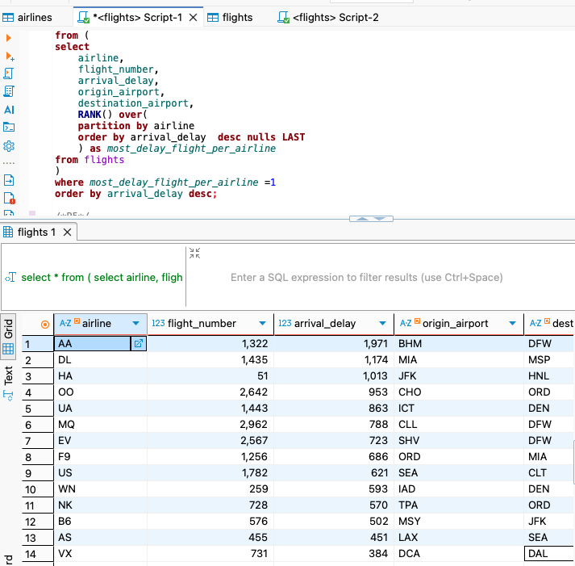

**W2**
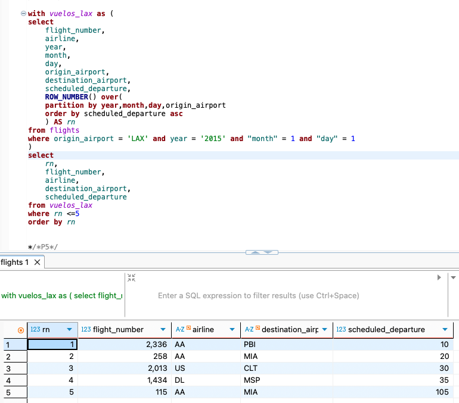

**W3**
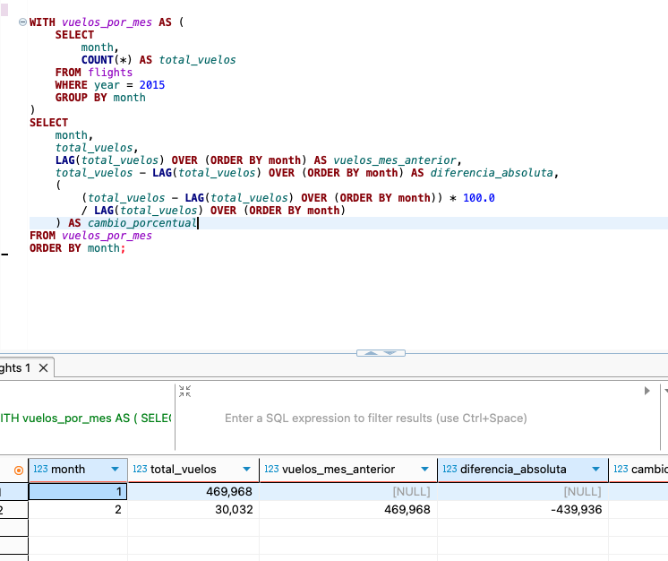


---

### 8. Notebook — Análisis Estadístico

`notebooks/flights_analytics.ipynb` implementa dos análisis estadísticos sobre los datos de vuelos: una regresión lineal para identificar los factores que explican el retraso de llegada, y un pronóstico de series de tiempo para estimar la demanda mensual de vuelos.

---

#### 8.1 Regresión Lineal — ¿Qué factores explican el retraso de llegada?

**Descripción:**
- Lee 500,000 observaciones aleatorias desde `flights_gold.vuelos_analitica` en Athena
- Ajusta un modelo OLS con `statsmodels` usando `arrival_delay` como variable objetivo

**Variable objetivo y features:**

| Variable | Rol |
|---|---|
| `arrival_delay` | Variable objetivo `y` |
| `departure_delay`, `distance` | Features independientes |
| `air_system_delay`, `airline_delay`, `weather_delay`, `late_aircraft_delay`, `security_delay` | Componentes de retraso |

**Métricas reportadas:**
- **R²** — 0.9418
- **RMSE** — 9.46 minutos

**Visualizaciones generadas:**

- Coeficientes con intervalos de confianza al 95%
- Valores predichos `ŷ` vs. valores reales `y`
- Residuos vs. valores predichos
- Q-Q plot de residuos — diagnóstico de normalidad |

**Prerequisitos:**
- Capa Gold ejecutada (`flights_gold.vuelos_analitica` disponible en Athena)
- Librerías: `statsmodels`, `scikit-learn`, `matplotlib`, `awswrangler`

---

#### 8.2 Pronóstico de Series de Tiempo — ¿Cuántos vuelos habrá en los próximos meses?

**Descripción:**
- Lee el total mensual de vuelos desde `flights_silver.flights_monthly` en Athena
- Construye una serie de tiempo en formato StatsForecast (`unique_id`, `ds`, `y`)
- Divide en train (ene–sep 2015, 9 meses) y test (oct–dic 2015, 3 meses)
- Ajusta tres modelos automáticos y pronostica 9 pasos: 3 sobre el test set y 6 hacia 2016

**Modelos ajustados:**

| Modelo | Especificación seleccionada | MAE test set |
|---|---|---|
| AutoARIMA | ARIMA(0,0,0) | ~9,512 vuelos/mes * mejor |
| AutoETS | ETS(A,N,N) | ~9,530 vuelos/mes |
| AutoTheta | OTM | ~18,735 vuelos/mes |

> Con 9 puntos de entrenamiento los tres modelos generan el mismo promedio para los próximos meses, con tan pocos datos no se captura la estacionalidad.

**Visualizaciones generadas:**

Pronóstico vs. valores reales en test set con bandas CI 90%
Pronóstico ene–jun 2016 con bandas CI 90%
Comparación de MAE por modelo en el test set

**Prerequisitos:**
- Capa Silver ejecutada (`flights_silver.flights_monthly` disponible en Athena)
- Librerías: `statsforecast`, `scikit-learn`, `matplotlib`, `awswrangler`

